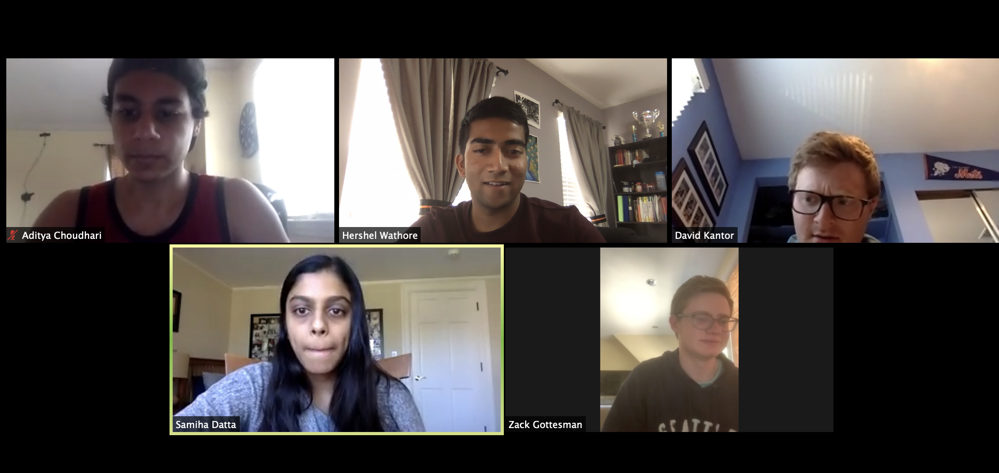

# Project Name

TODO: short project description, some sample screenshots or mockups

(Initial Stage)
Our plan for GreenTrace is to develop a React Native application which enables contact tracing for Dartmouth students specifically. Some of the main features we intend to implement are an alert system to notify users when they've been near someone who has COVID-19, a portal allowing users to identify themselves as COVID-19 positive, and potentially a heat map of campus to show users which areas may be COVID-19 hotspots.

## Architecture

TODO:  descriptions of code organization and tools and libraries used

(Initial Stage) - Server Side
To start off, we've decided to base the server side for our application off of the server we built for Lab 5. We plan models and controllers for both users (to use for authentication and potentially to record their current COVID-19 status) and for data observations (to help us track our user's movements). Our user model will be fairly straightforward with the previously described fields. Our observations model will record each location observation that we record from our user. In our model, we will include fields for latitude, longitude, user ID (we don't want to use name here necessarily for privacy concerns), and a timestamp of the observation. Additionally, we plan to use Mongo to store our data.

(Inital Stage) - Front-end
For our front-end, we plan to use React Native to build a mobile application. We intend to craft our app so that it's as seamless as possible. When a user first opens the app, if they're not signed in (or signed up) yet, they will be directed to a simple, clean page with buttons to either sign up or log in. If they select sign up, they will be routed to a sign up form which they will need to fill out. Once they're signed in, they will be directed to a home page which we hope to display our heat map. Then, we will use a bottom navigation bar to allow the user to navigate to a page showing their recent COVID-19 alerts or a page giving them the ability to self-report themselves as COVID-19 positive. Of course, we will include a settings page as well, and this will likely be available from any of the pages. In terms of libraries/tools, we plan to use Expo, the Expo Location API, and likely the Google Maps API. 

## Setup

TODO: how to get the project dev environment up and running, npm install etc

(Notes for Initial Stage)
We will definitely need install Expo, the Expo Location API, and the Google API. Of course, we need Node.js as well.

* Expo Installation:  `npm install -g expo-cli`
* Expo Location API Installation: `expo install expo-location` then configure for iOS or Android (https://github.com/expo/expo/tree/master/packages/expo-location)
* Google Maps API Installation: Configure through Google like we've done previously for other assignments (https://developers.google.com/maps/documentation/embed/get-api-key)

## Deployment

TODO: how to deploy the project
(Undecided as of now)

## Authors

David Kantor, Aditya Choudhari, Hershel Warthore, Samiha Datta, Zach Gottesman, and Srishti Bagchi

## Acknowledgments
