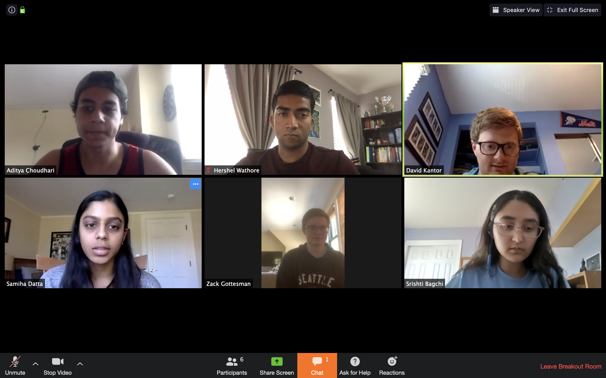

# GreenTrace



GreenTrace is a contact tracing mobile application for COVID-19 at Dartmouth College. We implement functionality for:
- An notifications page to inform users when they've been in contact with someone who has tested positive for COVID-19
- A form to allow users to report their testing status, COVID-19 status, and relevant symptoms
- A heat map of campus (or of wherever users are) to show potential COVID-19 hotspots
- A risk assessment page based on a user's information

We also want to honor our users privacy as much as possible, and to that end, we took a few key steps. First and foremost, **no identifying information** (such as email, name, or Dartmouth ID) is persisted to our MongoDB storage. Users do enter in their email address when signing up but this is only to send them a phrase token which they will use upon subsequent sign in attempts. Further, all location and contact data is discarded after two weeks. Users may also log out at any point.

[Figma Link for our mockups](https://www.figma.com/file/yxsUgPFvbNk1mntMHKRfp1/GreenTrace?node-id=70%3A226)

## Architecture


```
.
├── App.js
├── app.json
├── assets
│   └── ...
├── components
│   ├── HeatMap.js
│   ├── Location.js
│   ├── account-info.js
│   ├── alerts-detail.js
│   ├── alerts.js
│   ├── drawer-toggle.js
│   ├── information.js
│   ├── map.js
│   ├── password-modal.js
│   ├── privacy-info.js
│   ├── resources.js
│   ├── risk-detail.js
│   ├── risk-dial.js
│   ├── risk-info.js
│   ├── risk.js
│   ├── signin.js
│   ├── signup.js
│   ├── status-update-modal.js
│   ├── status.js
│   ├── symptom-check.js
│   └── symptom-initial.js
├── lib
│   ├── date-lib.js
│   ├── resources.json
│   └── risk.json
├── navigation
│   ├── alert_tab.js
│   ├── info_tab.js
│   ├── main_navigation.js
│   ├── main_tab_bar.js
│   ├── map_tab.js
│   ├── risk_tab.js
│   ├── status_tab.js
│   └── symptom_stack.js
├── reducers
│   ├── auth_reducer.js
│   ├── index.js
│   ├── locationsReducer.js
│   ├── messagesReducer.js
│   ├── risk_reducer.js
│   └── user_reducer.js
├── services
│   └── api.js
├── web-build
│   └── register-service-worker.js
└── yarn.lock
```
    
This mobile application is built with [React Native](https://reactnative.dev/) and uses several React Native component libraries and packages. It uses [Redux](https://redux.js.org/) to store global states and makes API calls to the server using [Axios](https://github.com/axios/axios).

### Feature Overview

#### Sign In/Sign Up
Users can sign up with their dartmouth emails, and a two-word token will be sent to them. In the sign in page, they can use this token to log in and access the rest of the app. A two-word token is used to ensure the anonymity of users as medical data will not be linked to an email in our database.

#### Location Services

NEEDS TO BE FILLED IN

#### Risk

Our risk page has a few features. The first is a risk dial which displays the individual's risk level. We determined their risk level with their COVID status, their testing status, and their number of symptoms. We decided against including their number of contacts in the risk algorithm because we could not find a way to standardize the data. Below our risk dial, we included a 'Learn More' button which explains our risk level calulcations to the user. The next main section of our risk page is the risk statistics section. Here, we show the user how many of their contatcs have tested positive for COVID-19, how many symptoms they're displaying, how many total users have been tested, and how manu users have identified themselves as COVID-19 positive. 

#### Alerts
Users can check messages indicating if they have come into contact with anyone who is being tested or is confirmed positive for COVID-19. Clicking on an individual message will display the date that the contact happened as well.

#### Status Updates
On the status page, users can specify their COVID-19 status (whether one is positive or negative), their current testing status, as well as the symptoms they are experiencing. Upon pressing submit, this information will be sent to the backend server; if the user specified that they are positive, then other users they came in contact with will be notified.

#### Info
Users can see their account user token on this page for reference. They are also able to change their passwords and log out of the app on this page. 

## Setup
### Retrieving Code

First, run `git clone git@github.com:dartmouth-cs52-20S/project-greentrace.git` in the desired directory to retrieve the frontend code.

### Dependencies

Expo, the Expo Location API, and the Google API are core dependencies for this project.

* Expo Installation:  `npm install -g expo-cli`
* Expo Location API Installation: `expo install expo-location` then [configure](https://github.com/expo/expo/tree/master/packages/expo-location) for iOS or Android 
* Google Maps API Installation: [Configure through Google](https://developers.google.com/maps/documentation/embed/get-api-key)

Run `yarn` in the project directory to fetch and download all packages and dependencies.

### Starting up App
Once all packages and dependecies have been installed, run `expo start` in the root directory. Upon running this command, the expo terminal will open in your browser, and there will be a QR code displayed. 

#### Using Expo on your Phone
To use the GreenTrace app on your smart phone, you will need to download the Expo app (it is available in the major application stores like Apple's App Store and Android Google Play Store). Upon downloading the app, open up any app that is able to scan a QR code (such as a typical camera app) and scan the QR code on the Expo terminal. This will redirect your phone to the Expo app, which will open up the GreenTrace application for you to use. If you are using an Android device, use the Expo app itself to scan the QR code. Upon opening the app, if it is your first time using it, you will be prompted for location tracking. Make sure to always allow the app to track your location. 

#### Using Expo in an iOS Simulator
To test out the GreenTrace app in an iOS simulator, you need to first have XCode downloaded on your laptop. Once you have XCode on your laptop, click the link on the Expo terminal on your browser that says 'Run on iOS simulator.' This will automatically open up an iOS simulator and load up the GreenTrace app. When you are prompted with location services, make sure to always allow the app to track your location. 


## Deployment

Expo with email `greentracedartmouth@gmail.com` and password `DartmouthGreenTraceCS52`.
It should be located in the projects there!

## Authors

David Kantor, Aditya Choudhari, Hershel Warthore, Samiha Datta, Zach Gottesman, and Srishti Bagchi

## Acknowledgments

We would like to thank Professor Tim Tregubov for teaching us everything we know about web dev during the course of CS 52 and therefore allowing this project to be a reality. We would also like to thank Alexis Harris for listening to our constant pleas for help fixing bugs and for giving amazing advice about how to build a (we hope!) functional app at this scale.

We also benefitted from the work of many open source project for everything from our entire front end framework to the ability to generate random words for our ID tokens. We cannot name all of them, but Expo, Express, and React Native were particularly useful.
